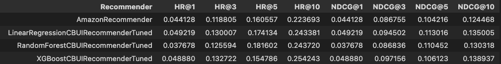

# Recommending Systems Project
> Content-Based Recommender - Adam Hącia 2022

## Table of contents
- [Recommending Systems Project](#recommending-systems-project)
  - [Table of contents](#table-of-contents)
  - [Achieved results compared to Amazon Recommender](#achieved-results-compared-to-amazon-recommender)
  - [Project Description](#project-description)
  - [Technologies](#technologies)
  - [Setup](#setup)
  - [Status](#status)
  - [Contact](#contact)

## Achieved results compared to Amazon Recommender


## Project Description

Content-based recommender system that recommends products based on the content of the product description.

## Technologies
* Python 3.9.7
* Anaconda + Jupyter

## Setup
1. Install Anaconda with Python >= 3.8.
2. Prepare your conda environment
     + Run the following command:
    ``` conda create -n recommender python=3.8```
     + Activate the conda environment by running:
    ``` conda activate recommender ```
3. Install the required packages
     + Run the following commands:
    ``` conda install numpy ```
    ``` conda install pandas ```
    ``` conda install matplotlib ```
    ``` conda install seaborn ```
    ``` conda install sklearn ```
    ``` conda install hyperopt ```
4. In Bash type:
   ```jupyter notebook```
   The notebook will be opened in your browser.
5. In Jupyter Notebook open these files and run all cells:
   ```project_1_data_preparation```
   ```project_1_recommender_and_evaluation```
6. Last cell in `project_1_recommender_and_evaluation.ipynb` should contain the results of the evaluation with HR@10 metric for 
   * LinearRegressionCBUIRecommender
   * AmazonRecommender
   * RandomForestCBUIRecommender
   * XGBoostCBUIRecommender

## Status
Project is: _completed_

## Contact
Created by [@HondaPL](https://github.com/HondaPL/)